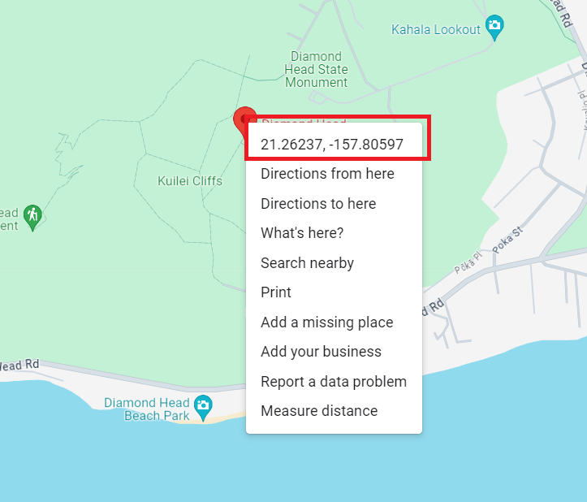
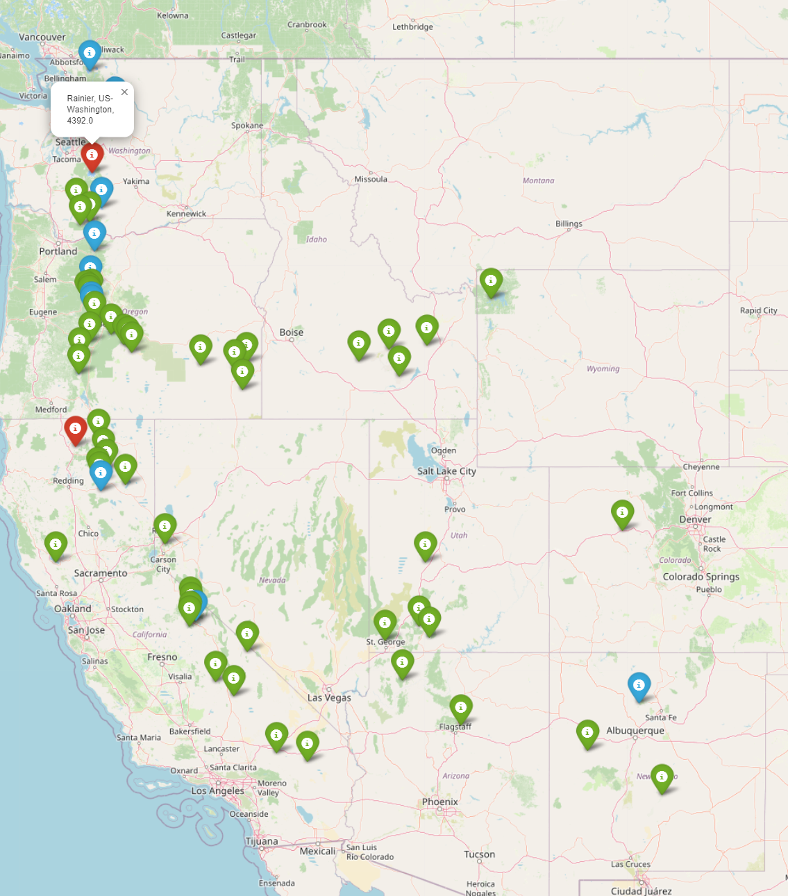
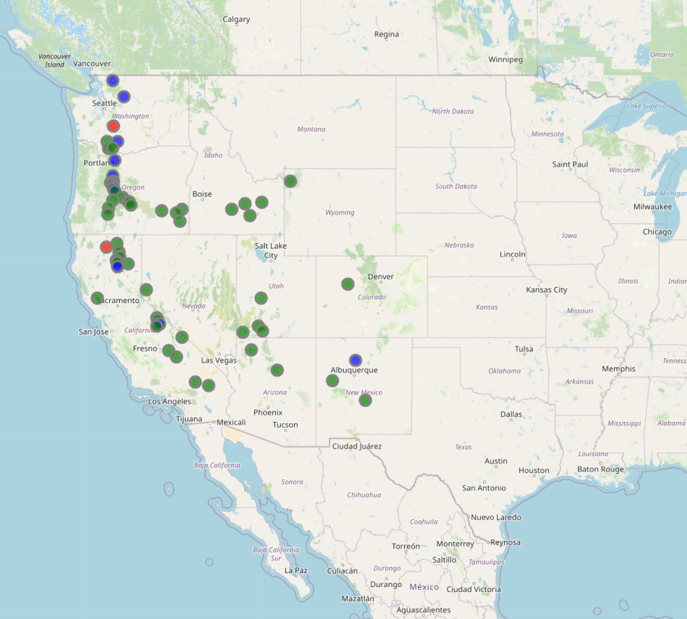
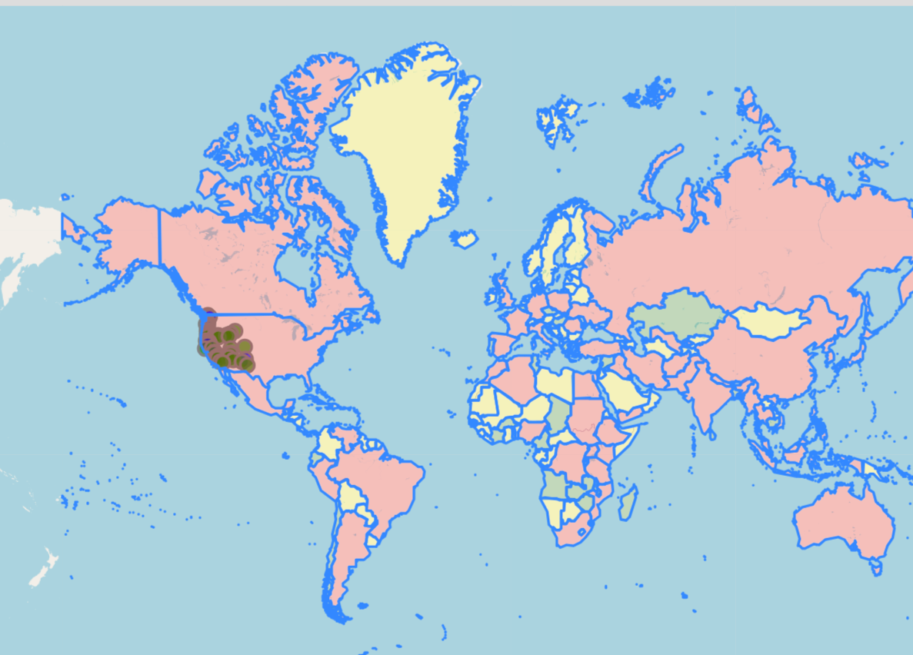
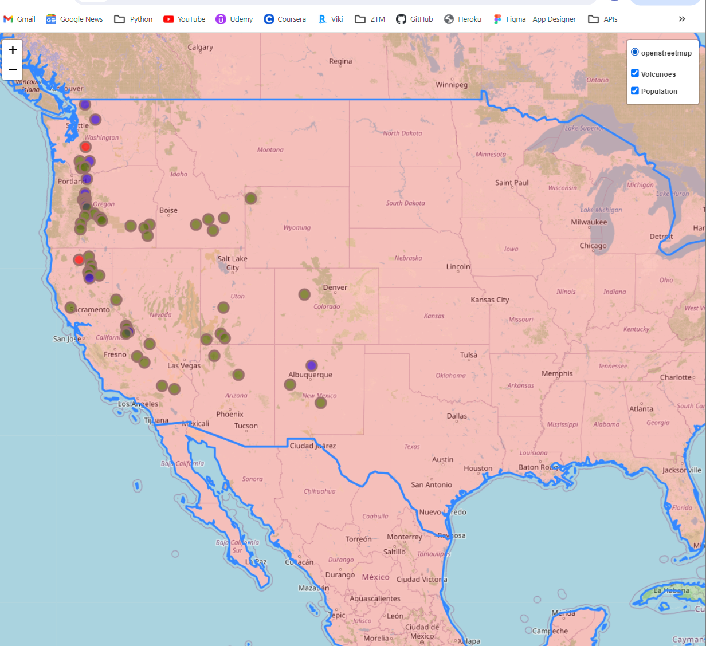

# Creating a world map using Python and Folium


## install folium

pip install third-part app: folium (this time recording is 0.16.0 with Jinja2=3.1.4)

```bash
$ pip install folium
```

**NOTE**: if jinja2 is not installed, then perform `pip install Jinja2`

Don't forget to save your dependencies (third-party apps) to a requirements file

```bash
$ pip freeze > requirements.txt
```

## Create a map object using folium

Create a map object to start using the folium map feature

```bash
$ map = folium.Map([<lat>, <long>])
```

where

- < lat > - is the latitude value (-90, 90)
- < long > - is the longitude value (-180, 180)

**NOTE**: use [Google Maps](https://maps.google.com), select a point (right click) and copy the long, lat of the point



```python
Example:
$ map = folium.Map([21.26237, -157.80597])
```

**NOTE**: `Map` is different from `map`, so don't confuse them

This will create a folium.Map object.  Next save the map as `.html`

## Save Coordinates to an htmml

Save the object as an html file

```python
$ map.save("<filename>")
Example
$ map.save("map2.html")
```

This will be saved as an html file in your working folder.  You can then preview it in a browser.

## Add a point to a map object

Just to emphasize, the world map is the background (always fixed). The object of Folium is adding layers on top of the background, like pins, outlines, etc.

You will create a folium.FeatureGroup that will act like a layer above the background/base image.

```python
import folium

map = folium.Map(location=[<lat, long>], start_zoom=<1-10>)     << location will be somewhere the background/base map will center around

fg = folium.FeatureGroup(name=<name>)   << this creates a new layer
fg.add_child(folium.Marker(location=[<long, lat>], popup=<description>, icon=<folium.color>))  << this creates a pin (folium.Marker)

map.add_child(fg)   << this includes the new layer on top of the original map

map.save(<filename>.html)   << saves the file to the specific html name
```

## Adding Multiple Points to a map object

Import pandas, since the data might be in a csv format

Find the latitude and longitude data, extract the lat, long data and put it in a list format.  Then send the list of [lat,long] data to a `for loop`.

You can also do some tricks, by using `enumerate` in the for loop, then you can use `.loc` on a dataframe to select the specific rows

```python
import folium
import pandas as pd

df = pd.read_csv('./Volcanoes.txt')
df_lat = df['LAT']
df_lon = df['LON']

latlong = []
# folium requires the lat, long be in a list form
for i, item in enumerate(df_lat):
    latlong.append([df_lat[i], df_lon[i]])


# This will center the map
map = folium.Map(location=[21.21637, -157.80597], zoom_start=6)

# Create a FeatureGroup that could be used as a layer
fg = folium.FeatureGroup(name='My Map')

# Add a point ontop of the background Marker, CircleMarker
for i, coordinates in enumerate(latlong):
    fg.add_child(folium.Marker(coordinates, popup=f"{df.loc[i]['NAME']}, {df.loc[i]['LOCATION']}, {df.loc[i]['ELEV']}", icon=folium.Icon(color='green')))

# Add all of the points to the background/main map
map.add_child(fg)

map.save('map4_withMarkersFromVolcanoFile.html')
```

### Change marker colors based on elevation

Depending on the data, you can show different marker colors for each point.  This example will change the color of the pin, depending on the volcano heigh.

```python
# Add a point ontop of the background Marker, CircleMarker
for i, coordinates in enumerate(latlong):
    if df.loc[i]['ELEV'] > 4000:            << height above 4000m
        height_color = 'red'
    elif df.loc[i]['ELEV'] >= 3000:         << height above 3000m
        height_color = 'blue'
    else:                                   << height between 0-2999m
        height_color = 'green'

    #option 1
    fg.add_child(folium.Marker(coordinates, popup=f"{df.loc[i]['NAME']}, {df.loc[i]['LOCATION']}, {df.loc[i]['ELEV']}", icon=folium.Icon(color=height_color)))
```

Other options could be in this example:

- Depending on longitude and the timezones, you can color markers between PST, MST, CST, EST
- Based on the type of volcano: ['Stratovolcanoes', 'Stratovolcano', 'Volcanic field','Shield volcanoes', 'Maar', 'Cinder cones', 'Shield volcano','Complex volcano', 'Caldera', 'Calderas', 'Fissure vents', 'Lava domes', 'Maars', 'Cinder cone']

    - Note: captured the types of volcanoes by using unique.

```bash
$ typeOfVolcanoes = df['TYPE'].unique()
```



## Using a different marker: CircleMarker

Use `dir(< package >)` to get other options, also use `help(< package >.< method >)` to get some understanding

```python
Example
$ dir(folium)

$ help(folium.Marker)
```

Code Changes

```python
import folium
import pandas as pd

df = pd.read_csv('./Volcanoes.txt')
df_lat = df['LAT']
df_lon = df['LON']
df_elev = df['ELEV']

latlong = []
# folium requires the lat, long be in a list form
for i, item in enumerate(df_lat):
    latlong.append([df_lat[i], df_lon[i]])

# This will center the map
map = folium.Map(location=[21.21637, -157.80597], zoom_start=6)

# Create a FeatureGroup that could be used as a layer
fg = folium.FeatureGroup(name='My Map')

# Add a point ontop of the background Marker, CircleMarker
for i, coordinates in enumerate(latlong):
    if df.loc[i]['ELEV'] > 4000:
        height_color = 'red'
    elif df.loc[i]['ELEV'] >= 3000:
        height_color = 'blue'
    else:
        height_color = 'green'

    ##### ORIGINAL #######
    fg.add_child(folium.Marker(coordinates, popup=f"{df.loc[i]['NAME']}, {df.loc[i]['LOCATION']}, {df.loc[i]['ELEV']}", icon=folium.Icon(color=height_color)))
    ######### THE NEW CHANGE #######################################
    fg.add_child(folium.CircleMarker(coordinates, radius=5, popup=f"{df.loc[i]['NAME']}, {df.loc[i]['LOCATION']}, {df.loc[i]['ELEV']}", fill_color=height_color, color='grey', fill_opacity=0.7))

# Add all of the points to the background/main map
map.add_child(fg)

map.save('map5_witCirclehMarkersFromVolcanoFile.html')
```




## Adding Polygraphs as another Layer

Example to represet a population around the country

```python
import folium
import pandas as pd

df = pd.read_csv('./Volcanoes.txt')
df_lat = df['LAT']
df_lon = df['LON']
df_elev = df['ELEV']

latlong = []
# folium requires the lat, long be in a list form
for i, item in enumerate(df_lat):
    latlong.append([df_lat[i], df_lon[i]])

# This will center the map
map = folium.Map(location=[21.21637, -157.80597], zoom_start=6)

# Create a FeatureGroup that could be used as a layer
fg = folium.FeatureGroup(name='My Map')

# Add a point ontop of the background Marker, CircleMarker
for i, coordinates in enumerate(latlong):
    if df.loc[i]['ELEV'] > 4000:
        height_color = 'red'
    elif df.loc[i]['ELEV'] >= 3000:
        height_color = 'blue'
    else:
        height_color = 'green'

    fg.add_child(folium.CircleMarker(coordinates, radius=5, popup=f"{df.loc[i]['NAME']}, {df.loc[i]['LOCATION']}, {df.loc[i]['ELEV']}", fill_color=height_color, color='grey', fill_opacity=0.7))

 ######### THE NEW CHANGE #######################################
# adding a new later for polygon layer (areas)
fg.add_child(folium.GeoJson(data=open('./world.json', 'r', encoding='utf-8-sig').read(), 
                            style_function=lambda x: {'fillColor':'yellow' 
                                                      if x['properties']['POP2005'] < 10_000_000 
                                                      else 'green' if 20_000_000 > x['properties']['POP2005'] >= 10_000_000 
                                                      else 'red'}))


# Add all of the points to the background/main map
map.add_child(fg)

map.save('map6_withGeoJSON_world.html')
```



## Include Layer Control to turn-on/off layers

Layer Control is useful to remove certain layers from the map.  The key is to enable Layer Control after all FeatureGroups are added the BaseImage(map).  Also should separate each layer with a FeatureGroup; for instance, this example will need to make separate feature groups for Volcanoes and Population.  Therefore FeatureGroups need to be different variables and then adding to map, 2 different children.  Then you can add Layer Control

```python
import folium
import pandas as pd

df = pd.read_csv('./Volcanoes.txt')
df_lat = df['LAT']
df_lon = df['LON']
df_elev = df['ELEV']

latlong = []
# folium requires the lat, long be in a list form
for i, item in enumerate(df_lat):
    latlong.append([df_lat[i], df_lon[i]])

# This will center the map
map = folium.Map(location=[21.21637, -157.80597], zoom_start=6)

# Create a FeatureGroup that could be used as a layer
fg = folium.FeatureGroup(name='Volcanoes')
fg2 = folium.FeatureGroup(name='Population')    << created separate FeatureGroups

# Add a point ontop of the background Marker, CircleMarker
for i, coordinates in enumerate(latlong):
    if df.loc[i]['ELEV'] > 4000:
        height_color = 'red'
    elif df.loc[i]['ELEV'] >= 3000:
        height_color = 'blue'
    else:
        height_color = 'green'

    fg.add_child(folium.CircleMarker(coordinates, radius=8, popup=f"{df.loc[i]['NAME']}, {df.loc[i]['LOCATION']}, {df.loc[i]['ELEV']}", fill_color=height_color, color='grey', fill_opacity=0.7))

# adding a new later for polygon layer (areas)
fg2.add_child(folium.GeoJson(data=open('./world.json', 'r', encoding='utf-8-sig').read(),      << updated fg to be fg2 for a new FeatureGroup
                            style_function=lambda x: {'fillColor':'yellow' 
                                                      if x['properties']['POP2005'] < 10_000_000 
                                                      else 'green' if 20_000_000 > x['properties']['POP2005'] >= 10_000_000 
                                                      else 'red'}))


# Add all of the points to the background/main map
map.add_child(fg)               
map.add_child(fg2)              << Added the FeatureGroup as a child to the base image

map.add_child(folium.LayerControl())    << Enabled Layer Control


map.save('interactive_world.html')
```

